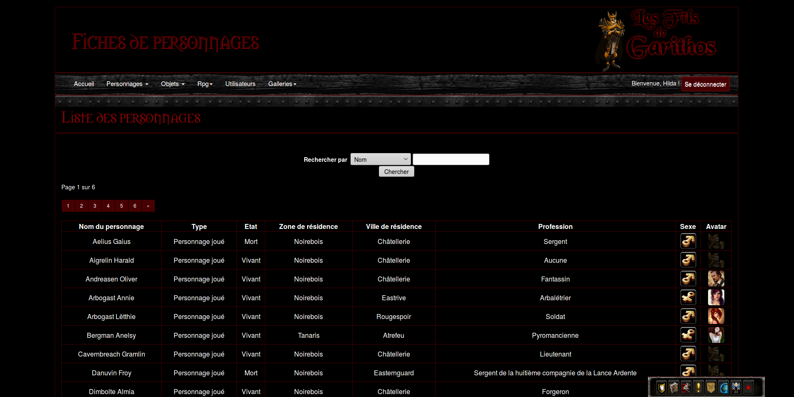

# firp

This is the code for the site I created for my roleplay guild on World of Warcraft (Eu-Kirin Tor server).

It is built around character sheets for our characters, but there are other "modules" like the display of the spells we are using (based on warcraft rpg) or the display of campaign reports.

___

You can see the resulting site here:
https://www.filsdegarithos.ovh/

The forum is a simple phpbb.

___

Images credits:

Most images belong to Blizzard, since this is a fansite.
